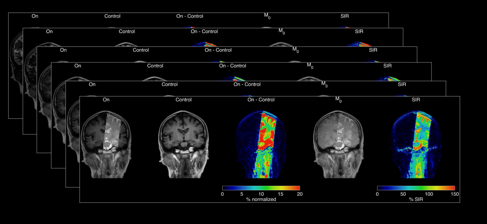
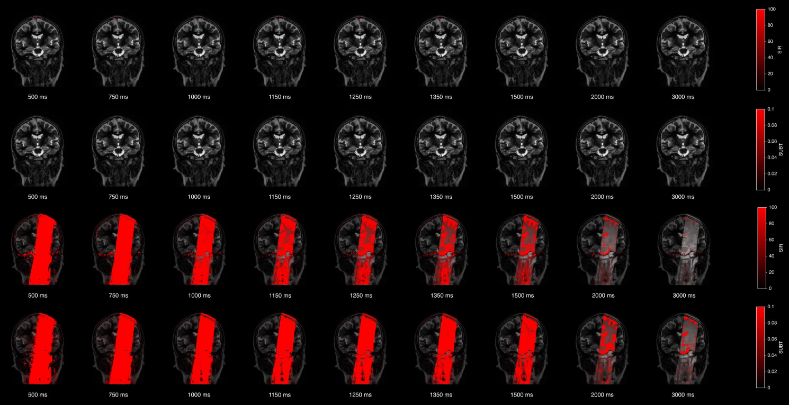

# Bi-component Modeling of CSF Outflow Using Time-SLIP MRI

[](https://doi.org/10.5281/zenodo.17982328)

This repository contains MATLAB code for analyzing cerebrospinal fluid (CSF) outflow dynamics using non-contrast Time–Spatial Labeling Inversion Pulse (Time-SLIP) MRI. The pipeline implements a bi-component analytical model that separates fast bulk-displacement and slower perfusion-like components of CSF signal evolution, enabling region-resolved and age-sensitive characterization of CSF outflow pathways in the human brain.

<p align="center">
  
</p>

---

## Scientific Overview

Effective clearance of metabolic waste from the brain depends on coordinated transport within the neurofluid system, which includes cerebrospinal fluid (CSF), interstitial fluid (ISF), and blood. Time-SLIP MRI enables direct visualization of intrinsic CSF motion without exogenous contrast agents. However, the resulting signal reflects multiple transport regimes operating on different timescales.

This codebase implements a validated bi-component model that decomposes the Time-SLIP signal increase ratio (SIR) into:
- a **fast Gaussian component**, capturing bulk-like displacement of labeled CSF, and  
- a **slower Γ-variate component**, reflecting perfusion-like or dispersive transport.

Together, these components provide a compact yet physiologically meaningful description of CSF outflow dynamics suitable for regional and age-related analyses.

---

## Visualization and ROI Handling

The pipeline supports automated visualization of CSF signal evolution across inversion times, including region-specific zooming and overlay modes.

<p align="center">
  
</p>

Regions of interest (ROIs) are defined relative to the superior sagittal sinus (SSS) and subdivided into upper, middle, and lower parasagittal dura compartments, with left–right separation based on the enlarged SSS midline. These definitions are consistent across subjects and analyses.

---

## Signal Derivation and Colormap Outputs

The repository includes custom colormaps and visualization utilities for inspecting intermediate and derived signals, including Tag, Control, Tag–Control subtraction, and SIR maps.

<p align="center">
  
</p>

These outputs facilitate qualitative assessment of CSF outflow patterns and validation of model fits across regions and inversion times.

---

## Repository Structure

```
.
├── ASL_main.m
├── asl_subroutines/
│   └── Time-SLIP and ASL-specific processing functions
├── subroutines/
│   └── General utilities (I/O, model fitting, statistics)
├── colormap/
│   └── Custom colormaps used for visualization
└── docs/
    ├── preview_hero_pipeline.png
    ├── preview_roi_zoom.png
    ├── preview_sir_subtraction.png
    └── VariablesFromFit.pdf
```

---

## Model Outputs and Metrics

A complete description of all model-derived parameters and signal metrics produced by this pipeline is provided in:

**`docs/VariablesFromFit.pdf`**

This document defines each output variable, including timing metrics (e.g., delays, time-to-peak), amplitude metrics (e.g., peak height, SIRmax), dispersion metrics (e.g., FWHM, AUC), and perfusion-like parameters for individual components and the aggregate bi-component model. Users are strongly encouraged to consult this PDF when interpreting output tables and figures.

---

## Requirements

- MATLAB (R2025b or later recommended)
- No external toolboxes required beyond standard MATLAB functionality

---

## Getting Started

1. Clone the repository:
   ```bash
   git clone https://github.com/vmalis/TimeSLIP-CSF-outflow
   ```
2. Add the repository to your MATLAB path.
3. Configure input data paths and parameters in `ASL_main.m`.
4. Run `ASL_main.m` to execute the full analysis pipeline.

---

## Test dataset

A fully anonymized Time-SLIP MRI test dataset supporting this pipeline is available on Zenodo:

Malis, V. (2025). *Time-SLIP MRI test dataset for regional CSF outflow modeling* (Version 1.0).  
Zenodo. https://doi.org/10.5281/zenodo.17982329

---

## Citation

If you use this code in your work, please cite the associated manuscript (details to be added upon publication).

---

## License

This project is released under the MIT License.  
See the `LICENSE` file for full license text.
